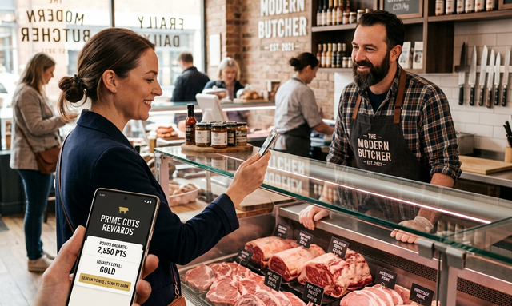

### **CarniApp aumenta las ventas y fideliza clientes de manera automática**

Gestionar el desequilibrio natural que se da en una carnicería es una de las tareas más críticas del carnicero. Trabajar con productos frescos y no almacenables comercialmente como la carne, presenta desafíos únicos. Vender la media res completa es el objetivo final, pero no siempre es fácil lograrlo. CarniApp nació para automatizar esa gestión, cada cliente con la app instalada se convierte en una oportunidad de venta inmediata a través de herramientas digitales precisas. La aplicación sabe a quien vender "qué" "cómo" "cuándo" y "dónde entregarlo".

### **Liquidar excedentes con precisión quirúrgica**
Cuando el clima o el mercado frenan la salida de ciertos cortes, CarniApp te permite actuar en segundos para que la mercadería nunca se detenga:
- **Flash-Sales dirigidas**: Lanzá notificaciones push a tus clientes "caza-ofertas" cuando necesités mover cortes específicos (como los de olla en días de calor, o el asado si el clima no acompaña).
- **Promociones Dinámicas**: Ajustá precios y combos en tiempo real dentro de la app para incentivar la compra de lo que hoy tenés en exceso, sin afectar el margen de lo que ya se vende solo.
- **Ofertas por proximidad**: Identificá y notificá a los clientes que se encuentran en tu radio de influencia inmediata para incentivarlos a pasar por el local o solicitar un delivery rápido, ideal para aprovechar el impulso de compra de quienes ya están cerca.
- **Planificación por pronóstico del tiempo**: CarniApp utiliza el pronóstico extendido para anticiparse al desequilibrio de stock. Si se vienen días soleados, la app promueve activamente cortes para horno u olla (que suelen estancarse ante la alta demanda orgánica de asado), permitiéndote "limpiar" la media res y tener margen para ofrecer más parrilla sin quedarte con excedentes del resto de la vaca. Lo mismo ocurre en días de lluvia: incentivamos aquello que no se vende solo, equilibrando tu rentabilidad sin importar el clima.

*La tecnología que convierte tu inventario en movimiento constante.*

### **Asegurar la base con el Cliente Fiel**
Mientras despejás el stock difícil con ofertas, CarniApp trabaja en segundo plano para que tus clientes más valiosos nunca se vayan:
- **Fidelización Automatizada**: El sistema de puntos premia cada compra de forma transparente, creando un vínculo que va más allá del precio.
- **Recordatorios Inteligentes**: La app detecta patrones de consumo y le recuerda al cliente volver a comprar sus cortes preferidos, asegurando un flujo de caja previsible y constante.

### **Control total sobre el mostrador**
CarniApp te brinda la infraestructura para que manejes tu negocio con datos, no solo con intuición:
- **Segmentación Inteligente**: Diferenciá automáticamente a tus compradores. Hablale al que busca calidad con novedades premium, y al que busca precio con tus ofertas estratégicas de stock.
- **Gestión de Demanda**: Anticipate a los desequilibrios. Si los datos muestran que un corte se está retrasando, podés activar una campaña antes de que el problema se vuelva crítico.

**CarniApp** es tu aliado técnico para que el mostrador sea siempre rentable, eficiente y, sobre todo, dinámico. Es la herramienta definitiva para que cada media res se venda completa, a tiempo y al cliente correcto.
